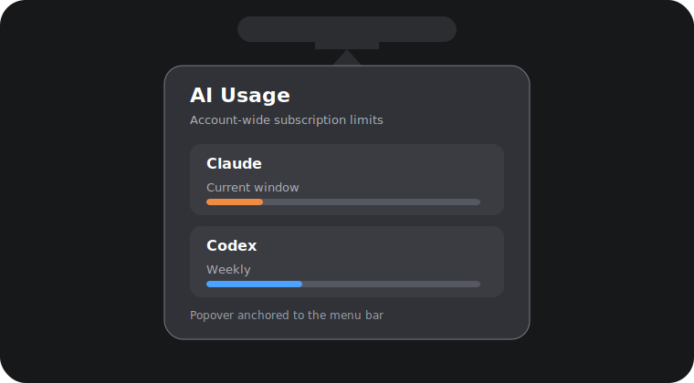
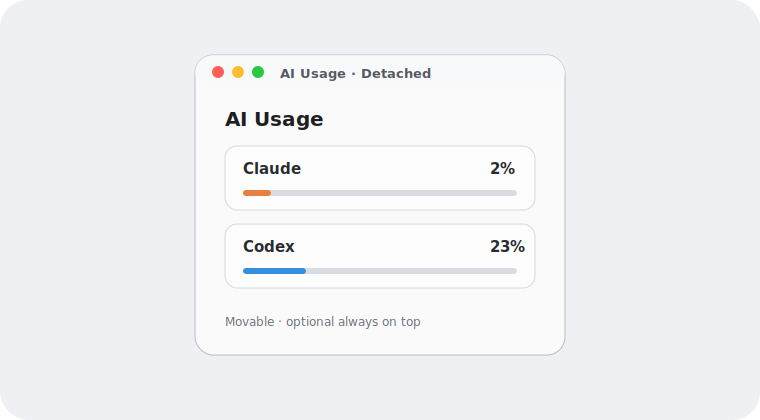
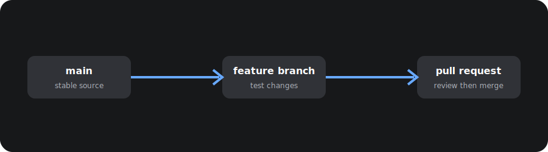

<p align="center">
  
</p>

<h1 align="center">AI Usage Widget</h1>

<p align="center">
  A privacy-first, native macOS utility for keeping Claude and Codex account limits visible.
</p>

<p align="center">
  
  
  
</p>

AI Usage Widget reads the server-reported subscription limits already available through the authenticated Claude Code and Codex clients on your Mac. It does not count local tokens, inspect transcripts, upload credentials, or run a backend.

## Highlights

- Account-wide Claude and Codex subscription limits
- Optional live percentages in the macOS menu bar
- Restored detailed provider-card interface
- Four optional 320×176 layouts: Claude, Codex, Gauge, and Apple
- System, Light, and Dark appearance modes
- Native menu-bar popover with arrow, detachable panel, and optional always-on-top detached window
- Five-minute refresh with last-known-good caching
- Always-on-top and launch-at-login options
- Native SwiftUI, no third-party dependencies, no analytics
- Read-only provider access; refreshes do not submit model prompts

## Visual examples

Attached to the menu bar, the app uses the native macOS popover arrow. Drag the popover away from the menu bar to detach it into a movable window.



The detached version keeps the same content and can optionally stay above other windows.



## Requirements

- macOS 14 or later on Apple silicon
- [Claude Code](https://docs.anthropic.com/en/docs/claude-code/getting-started) signed into a Claude subscription
- [Codex CLI](https://developers.openai.com/codex/cli/) signed in with ChatGPT

API billing and API-key rate limits are intentionally not supported. This app monitors subscription allowances.

## Install

1. Download the latest `AIUsageWidget-macOS.zip` from [Releases](../../releases/latest).
2. Unzip it and move `AI Usage Widget.app` to Applications.
3. Open it. If macOS blocks an unsigned community build, right-click the app and choose **Open**.
4. Make sure Claude Code has already been signed in and trusted on this Mac.

The release is ad-hoc signed. A notarized Developer ID build requires an Apple Developer account and is not currently provided.

## Menu bar percentages

Open Settings and enable:

1. **Show in menu bar**
2. **Show Claude and Codex percentages in menu bar**

The label uses `C` for Claude and `O` for OpenAI Codex.

## Privacy and security

- No telemetry, analytics, accounts, backend, or cloud sync
- No browser-cookie or transcript access
- No provider credentials stored by this app
- Normalized percentages and reset information are cached locally in `~/Library/Application Support/AIUsageWidget`
- Codex is read through its official local app-server protocol
- Claude is read through the built-in `/usage` screen in a bounded local PTY

The app does **not** require Screen Recording, Microphone, Accessibility, or Full Disk Access.

## Build from source

Full Xcode is optional for command-line builds:

```bash
swift build -c release
swiftc -parse-as-library \
  Sources/AIUsageWidget/Models.swift \
  Sources/AIUsageWidget/Providers.swift \
  Checks/SelfCheck.swift \
  -o .build/checks/self-check
.build/checks/self-check
./scripts/package.sh
```

The repository includes the Swift package source. The release workflow is currently manual because local authenticated provider verification cannot run safely in generic CI.

## Known limitations

- Provider client output can change; the app fails closed and keeps stale cached values instead of guessing.
- Claude Code can take up to 45 seconds to become ready when launched by macOS.
- This version is macOS-only because it relies on the locally authenticated desktop CLIs.

## Contributing

See [CONTRIBUTING.md](CONTRIBUTING.md). Security issues should follow [SECURITY.md](SECURITY.md), not a public issue.

## Git workflow

Git stores the source history; GitHub hosts the shared copy. Work on a branch, make a small commit, push it, then open a pull request. Keep `main` releasable.



```bash
git clone https://github.com/TheShadowLeader/ai-account-usage-widget.git
cd ai-account-usage-widget
git switch -c fix/my-change
swift build -c release
git add Sources README.md
git commit -m "Describe the change"
git push -u origin fix/my-change
```

For a normal update, pull before editing and never force-push `main`:

```bash
git switch main
git pull --ff-only
git switch -c feature/my-change
```

Releases are published from tested commits and attach the ZIP. Old release files are not part of the current source tree; the public repository contains only the current release line.

## License

MIT © 2026 TheShadowLeader
